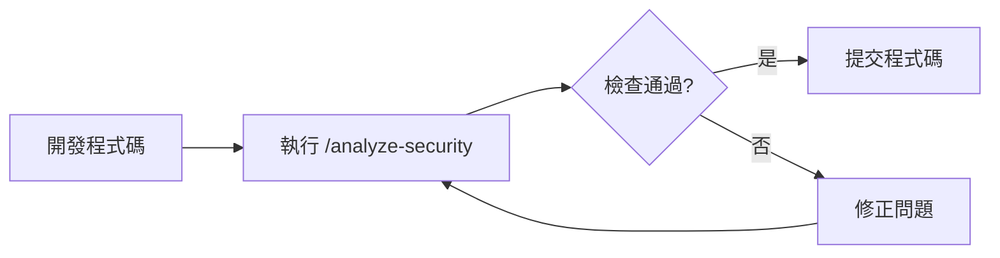

# Slash Commands 建立指南

> IBM Bob AI 助手 - Slash Command 完整教學

---

## 📚 目錄

1. [什麼是 Slash Command?](#什麼是-slash-command)
2. [為什麼需要 Slash Command?](#為什麼需要-slash-command)
3. [建立步驟](#建立步驟)
4. [檔案格式與語法](#檔案格式與語法)
5. [使用方式](#使用方式)
6. [最佳實踐](#最佳實踐)
7. [範例說明](#範例說明)
8. [與 AGENTS.md 整合](#與-agentsmd-整合)

---

## 什麼是 Slash Command?

**Slash Command** 是 IBM Bob 的自訂指令功能,讓你可以建立專案特定的快捷指令,用於執行重複性任務或複雜的檢查流程。

### 核心概念

```
/指令名稱 [參數]
```

例如:
- `/analyze-security` - 執行安全檢查
- `/review-code src/main/java/com/payment/model/Card.java` - 審查特定檔案
- `/check-bigdecimal` - 檢查 BigDecimal 使用情況

---

## 為什麼需要 Slash Command?

### 1. **標準化檢查流程**
將複雜的檢查步驟封裝成單一指令,確保每次檢查都遵循相同標準。

### 2. **提升開發效率**
避免重複輸入相同的檢查要求,一個指令完成多項檢查。

### 3. **知識傳承**
將專案的最佳實踐和檢查項目文件化,新成員可快速上手。

### 4. **專案特定需求**
針對專案特性(如金融系統的安全規範)建立客製化指令。

---

## 建立步驟

### Step 1: 建立目錄結構

在專案根目錄建立 `.bob/slash-commands/` 目錄:

```bash
mkdir -p .bob/slash-commands
```

### Step 2: 建立指令檔案

在 `.bob/slash-commands/` 目錄下建立 Markdown 檔案:

```bash
touch .bob/slash-commands/analyze-security.md
```

### Step 3: 撰寫指令內容

使用 Markdown 格式撰寫指令說明和執行步驟(詳見下方格式說明)。

### Step 4: 測試指令

在 Bob 對話中輸入 `/analyze-security` 測試指令是否正常運作。

---

## 檔案格式與語法

### 基本結構

```markdown
# 指令名稱

> 簡短描述

## 功能說明
詳細說明這個指令的用途

## 執行步驟
1. 第一步要做什麼
2. 第二步要做什麼
3. ...

## 檢查項目
- [ ] 檢查項目 1
- [ ] 檢查項目 2

## 輸出格式
說明指令執行後的輸出格式

## 使用範例
提供實際使用範例
```

### 進階語法

#### 1. 參數支援

```markdown
## 參數
- `file_path` (選填): 要檢查的檔案路徑
- `threshold` (選填): 檢查門檻值,預設 50000

## 使用方式
/analyze-security [file_path] [threshold]
```

#### 2. 條件執行

```markdown
## 執行邏輯
1. 如果提供 file_path,只檢查該檔案
2. 否則檢查整個專案
3. 根據 threshold 調整檢查標準
```

#### 3. 整合工具使用

```markdown
## 使用的 Bob 工具
- `search_files`: 搜尋特定模式
- `read_file`: 讀取檔案內容
- `list_files`: 列出目錄結構
```

---

## 使用方式

### 基本使用

在 Bob 對話框中直接輸入:

```
/analyze-security
```

### 帶參數使用

```
/analyze-security src/main/java/com/payment/controller/TransactionController.java
```

### 組合使用

可以在對話中結合其他指令:

```
請先執行 /analyze-security,然後根據結果修正程式碼
```

---

## 最佳實踐

### 1. **命名規範**

✅ **好的命名**:
- `/analyze-security` - 清楚表達功能
- `/check-bigdecimal` - 具體明確
- `/review-transaction` - 領域相關

❌ **不好的命名**:
- `/check` - 太籠統
- `/do-stuff` - 不明確
- `/abc123` - 無意義

### 2. **指令設計原則**

#### 單一職責
每個指令專注於一個明確的任務:

```markdown
# ✅ 好的設計
/analyze-security     # 只做安全檢查
/check-bigdecimal     # 只檢查 BigDecimal
/review-transaction   # 只審查交易相關程式碼

# ❌ 不好的設計
/do-everything        # 功能太多,難以維護
```

#### 可組合性
設計可以組合使用的指令:

```
/analyze-security && /check-bigdecimal
```

#### 清晰的輸出
提供結構化的檢查結果:

```markdown
## 輸出格式
✅ 通過項目
❌ 失敗項目
⚠️  警告項目
📊 統計資訊
```

### 3. **文件完整性**

每個指令都應包含:
- ✅ 功能說明
- ✅ 執行步驟
- ✅ 檢查項目
- ✅ 使用範例
- ✅ 預期輸出

### 4. **維護性**

#### 版本記錄
```markdown
## 更新記錄
- 2026-06-16: 新增 BigDecimal scale 檢查
- 2026-06-15: 初始版本
```

#### 參考連結
```markdown
## 相關文件
- [AGENTS.md](AGENTS.md) - 專案規範
- [security-analysis-report.md](security-analysis-report.md) - 安全報告範本
```

---

## 範例說明

### 範例 1: 安全檢查指令

檔案: `.bob/slash-commands/analyze-security.md`

**用途**: 檢查信用卡交易系統的安全規範

**檢查項目**:
1. 卡號遮罩實作
2. BigDecimal 金額處理
3. SQL 注入防護
4. 日誌安全

**使用場景**:
- 程式碼審查前
- 提交 PR 前
- 定期安全檢查

詳細內容請參考: [`.bob/slash-commands/analyze-security.md`](.bob/slash-commands/analyze-security.md)

### 範例 2: 程式碼審查指令 (未來擴充)

```markdown
# /review-transaction

檢查交易相關程式碼是否符合專案規範

## 檢查項目
- Constructor Injection 使用
- BigDecimal 處理
- 錯誤處理機制
- 日誌記錄
```

---

## 與 AGENTS.md 整合

### 關係說明

```
AGENTS.md (專案規範)
    ↓
Slash Commands (執行檢查)
    ↓
實際程式碼
```

### 整合方式

#### 1. 在 AGENTS.md 中參考 Slash Commands

```markdown
## 安全檢查

使用 `/analyze-security` 指令執行完整的安全檢查。

檢查項目包括:
- 卡號遮罩
- BigDecimal 使用
- SQL 注入防護
```

#### 2. 在 Slash Command 中參考 AGENTS.md

```markdown
## 檢查依據

本指令依據 [AGENTS.md](../AGENTS.md) 中定義的安全規範:
- 卡號遮罩: 參考 Card.getMaskedCardNumber()
- 金額處理: 參考 BigDecimal 使用規範
```

### 工作流程整合



---

## 進階主題

### 1. 條件式檢查

```markdown
## 執行邏輯
1. 檢查檔案類型
   - 如果是 Entity: 檢查 BigDecimal 和欄位定義
   - 如果是 Controller: 檢查 API 安全性
   - 如果是 Service: 檢查業務邏輯
```

### 2. 多階段檢查

```markdown
## 檢查階段
### 階段 1: 靜態檢查
- 搜尋關鍵字
- 檢查檔案結構

### 階段 2: 深度分析
- 讀取檔案內容
- 分析程式邏輯

### 階段 3: 產生報告
- 彙整檢查結果
- 提供修正建議
```

### 3. 自動化整合

```markdown
## CI/CD 整合
可在 CI/CD pipeline 中使用 Bob CLI 執行:

```bash
bob-cli execute /analyze-security
```
```

---

## 常見問題

### Q1: Slash Command 和 Custom Mode 有什麼不同?

**Slash Command**:
- 單次執行的指令
- 用於特定檢查或任務
- 檔案格式: Markdown

**Custom Mode**:
- 持續性的對話模式
- 改變 Bob 的行為和角色
- 檔案格式: YAML

### Q2: 如何除錯 Slash Command?

1. 檢查檔案路徑是否正確
2. 確認 Markdown 格式正確
3. 在 Bob 中測試執行
4. 查看 Bob 的回應訊息

### Q3: 可以在 Slash Command 中使用變數嗎?

可以透過參數傳遞:

```markdown
## 參數
- `$1`: 第一個參數
- `$2`: 第二個參數

## 使用範例
/my-command value1 value2
```

### Q4: 如何分享 Slash Command?

1. 將 `.bob/` 目錄加入版本控制
2. 團隊成員 clone 專案後即可使用
3. 在 README.md 中說明可用的指令

---

## 實戰練習

### 練習 1: 建立基礎指令

建立一個簡單的檢查指令:

```markdown
# /check-imports

檢查 Java 檔案的 import 語句

## 檢查項目
- [ ] 是否有未使用的 import
- [ ] 是否使用 wildcard import (*)
- [ ] import 順序是否正確
```

### 練習 2: 建立參數化指令

建立支援參數的指令:

```markdown
# /analyze-file

分析指定的 Java 檔案

## 參數
- `file_path`: 要分析的檔案路徑

## 使用範例
/analyze-file src/main/java/com/payment/model/Transaction.java
```

### 練習 3: 建立整合指令

建立整合多個檢查的指令:

```markdown
# /pre-commit-check

提交前的完整檢查

## 執行步驟
1. 執行 /analyze-security
2. 執行 /check-bigdecimal
3. 執行 /check-imports
4. 彙整所有結果
```

---

## 參考資源

### 官方文件
- [IBM Bob 官方文件](https://bob.ibm.com/docs)
- [Slash Commands 參考](https://bob.ibm.com/docs/slash-commands)

### 專案文件
- [AGENTS.md](AGENTS.md) - 專案規範
- [security-analysis-report.md](security-analysis-report.md) - 安全檢查報告
- [README.md](README.md) - 專案說明

### 範例指令
- [`.bob/slash-commands/analyze-security.md`](.bob/slash-commands/analyze-security.md) - 安全檢查指令

---

## 總結

### 關鍵要點

1. ✅ **Slash Command 是專案特定的快捷指令**
2. ✅ **使用 Markdown 格式撰寫**
3. ✅ **放在 `.bob/slash-commands/` 目錄**
4. ✅ **應與 AGENTS.md 整合**
5. ✅ **遵循單一職責原則**

### 下一步

1. 建立你的第一個 Slash Command
2. 在團隊中分享和討論
3. 持續優化和擴充指令庫
4. 整合到開發流程中

---

**版本**: 1.0.0  
**更新日期**: 2026-06-16  
**維護者**: IBM Bob Workshop Team